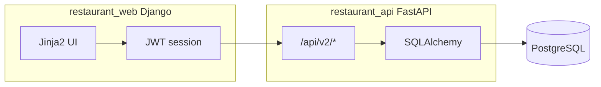

# Аудит соответствия программы техническому заданию

## Архитектура



- Данные: блюда, заказы, меню, клиенты, сотрудники, столики, ингредиенты — в PostgreSQL через API v2.
- Роли: `admin=1`, `manager=2`, `waiter=3` — в [restaurant_web/core/permissions.py](restaurant_web/core/permissions.py) и `require_roles` в API.

**Итоговая оценка:** **частичное соответствие** — логика и API в основном закрывают ТЗ; веб-часть и права ролей расходятся с требованиями в нескольких критичных местах.

---

## Соответствие по сущностям и операциям

| Требование ТЗ | API | Web UI | Статус |
|---------------|-----|--------|--------|
| Блюда: ввод, хранение, обработка, вывод | CRUD `/dishes/` | `/dishes/list/`, формы | **Да** |
| Заказы блюд | CRUD `/orders/` (создание — все роли) | `/orders/` | **Да** |
| Меню | CRUD `/menus/`, `dish_ids` | `/menus/`, публичное `/menu/` | **Да** (после исправления v2-схемы) |
| Клиенты | CRUD + `/clients/search/` | `/clients/` | **Частично** (см. баги) |
| Сотрудники | CRUD + `/employees/search/` | `/employees/` | **Частично** |
| Регистрация сотрудника | POST `/employees/` (только admin) | `/employees/create/` | **Частично** — шаблон отсутствует |
| Просмотр/редактирование сотрудников | GET manager+admin; PUT/DELETE admin | list/detail есть; create/update — **шаблонов нет** | **Частично** |
| Удаление сотрудников | DELETE admin | view есть | **Да** (API); UI create/update сломан |
| Прикрепление к столику | `/table-assignments/` (только role_id=3) | `/tables/` | **Да** |
| Поиск сотрудников по ФИО | `GET /employees/search/?q=` | view читает `q`, форма — `search` | **Частично** — поиск из UI не работает |
| Клиент: добавить/удалить/просмотр/поиск | Да | list/detail; create/update/purge — **шаблонов нет** | **Частично** |
| Очистка данных о клиентах | **Нет** endpoint purge | `client_purge` (admin), шаблон `purge.html` **отсутствует** | **Частично** |
| Просмотр меню | Публичный GET `/menus/` | `/menu/`, `/menus/` | **Да** |
| Редактирование меню, блюда в меню | manager+admin | формы меню/блюд | **Да** |
| Ингредиенты блюда | через `ingredient_ids` у блюда | `dishes/detail.html` | **Да** |
| Формирование заказа | POST `/orders/` | `/orders/create/` | **Да** |
| Печать меню Word/Excel | `/menus/{id}/export/docx|xlsx` (роли 1,2) | export views manager+admin; ссылки **без** `perms.can_export_menu_files` | **Частично** |
| Бонусы и акции для постоянных клиентов | `is_vip`, `bonus_points` | форма: `bonuses` вместо `bonus_points`, нет VIP; отдельных «акций» нет | **Частично** |
| Статистика заказов (менеджер) | нет отдельного API; агрегация в web | `/orders/statistics/` — **сломан шаблон** | **Нет** (страница не работает) |

---

## Соответствие по ролям

### Официант (ТЗ)

| Возможность | Реализация | Статус |
|-------------|------------|--------|
| Добавлять заказы | API + web, `can_create_order` | **Да** |
| Просмотр меню | Публичное `/menu/`, авторизованный `/menus/` | **Да** |
| Просмотр ингредиентов | `/dishes/<id>/` | **Да** |
| Печать меню Word/Excel | API/web — только manager+admin; ссылки на export видны всем на `/menus/` | **Нет** по ТЗ |

### Менеджер (ТЗ)

| Возможность | Реализация | Статус |
|-------------|------------|--------|
| Формирование меню | manager+admin | **Да** |
| Статистика заказов | view + template несовместимы | **Нет** |
| Закрепление официантов за столом | manager+admin, только waiter role_id=3 | **Да** |
| Личные карточки сотрудников | API: только **просмотр**; редактирование — **только admin** | **Нет** — менеджер не может заполнять/редактировать карточки |
| Личные карточки клиентов | manager+admin CRUD | **Частично** — create/update UI сломан (нет шаблонов) |

### Администратор (ТЗ)

| Возможность | Реализация | Статус |
|-------------|------------|--------|
| Добавление и редактирование всей информации | В API — да; в web — CRUD ролей без шаблонов `roles/*` | **Частично** |
| Регистрация через `/auth/register/` | Можно выбрать роль «Администратор» | **Риск безопасности**, не по духу ТЗ |

---

## Критические дефекты веб-интерфейса

Views ссылаются на несуществующие шаблоны (при открытии страниц — `TemplateDoesNotExist`):

- [client_views.py](restaurant_web/core/views/client_views.py): `clients/create.html`, `clients/update.html`, `clients/purge.html` — есть только [clients/form.html](restaurant_web/templates/clients/form.html)
- [employee_views.py](restaurant_web/core/views/employee_views.py): `employees/create.html`, `employees/update.html` — есть только [employees/form.html](restaurant_web/templates/employees/form.html)
- [role_views.py](restaurant_web/core/views/role_views.py): весь каталог `templates/roles/` отсутствует

**Статистика заказов** — несовпадение контекста:

```171:175:restaurant_web/core/views/order_views.py
    return render(request, 'orders/statistics.html', {
        'rows': rows,
        'total_orders': total_orders,
        'total_revenue': total_revenue,
    })
```

Шаблон [orders/statistics.html](restaurant_web/templates/orders/statistics.html) ожидает объект `stats` с `average_check`, `popular_dishes`.

**Клиенты — бонусы:** view читает `bonus_points`, форма [clients/form.html](restaurant_web/templates/clients/form.html) отправляет `bonuses`; список показывает `client.bonuses` вместо `bonus_points`.

**Поиск сотрудников:** [employees/list.html](restaurant_web/templates/employees/list.html) — `name="search"`, view — `request.GET.get('q')`.

---

## Что реализовано хорошо

- Полный набор сущностей и связей в API v2 (блюда, меню, заказы, клиенты, сотрудники, столики, ингредиенты).
- Разграничение ролей на уровне API (`require_roles`) для меню, блюд, клиентов, экспорта.
- Экспорт меню в DOCX/XLSX — [restaurant_api/app/utils/printing.py](restaurant_api/app/utils/printing.py).
- Закрепление официантов только с `role_id=3`.
- Публичный просмотр меню без авторизации.
- Тесты API (134 passed на отдельной БД `restaurant_test`).

---

## Рекомендуемые доработки (для полного соответствия ТЗ)

Приоритет **P0** (блокируют ТЗ на практике):

1. Подключить `clients/form.html`, `employees/form.html` в create/update; добавить `clients/purge.html`.
2. Починить `order_statistics`: передать `stats` с `total_orders`, `total_revenue`, `average_check`, `popular_dishes` (или упростить шаблон под `rows`).
3. Исправить поля клиента: `bonus_points`, чекбокс `is_vip` в форме и списке.

Приоритет **P1** (расхождение с ТЗ по ролям):

4. Дать **менеджеру** право редактирования карточек сотрудников (API PUT `/employees/` + web), оставив создание/удаление за admin — либо явно согласовать с заказчиком, что «регистрация» только у admin.
5. Разрешить **официанту** экспорт меню (API `ALLOWED_EXPORT_ROLE_IDS`, `can_export_menu_files`, условие в шаблонах menus).
6. Ограничить регистрацию: только waiter или только по приглашению admin.

Приоритет **P2**:

7. Поиск сотрудников: `search` → `q` в [employees/list.html](restaurant_web/templates/employees/list.html).
8. Скрыть export-ссылки за ``.
9. API endpoint массовой очистки клиентов (опционально) или документировать web-only purge.
10. Отдельная сущность «акции» или явное описание VIP/бонусов как реализации «акций» в документации.

---

## Вывод

| Критерий | Оценка |
|----------|--------|
| Backend / API vs ТЗ | ~**85–90%** |
| Web UI vs ТЗ | ~**60–70%** (из‑за отсутствующих шаблонов и багов) |
| Роли vs ТЗ | ~**75%** (менеджер и официант — ключевые расхождения) |
| **Общее соответствие** | **Частичное** — для защиты/сдачи проекта нужны доработки P0–P1 |

Программа **заложена под ТЗ** и покрывает большинство операций на уровне API, но **не полностью соответствует** формулировкам ТЗ по: печати меню для официанта, редактированию карточек сотрудников менеджером, статистике заказов, карточкам клиентов/сотрудников в UI, отдельным «акциям» и безопасной регистрации.
